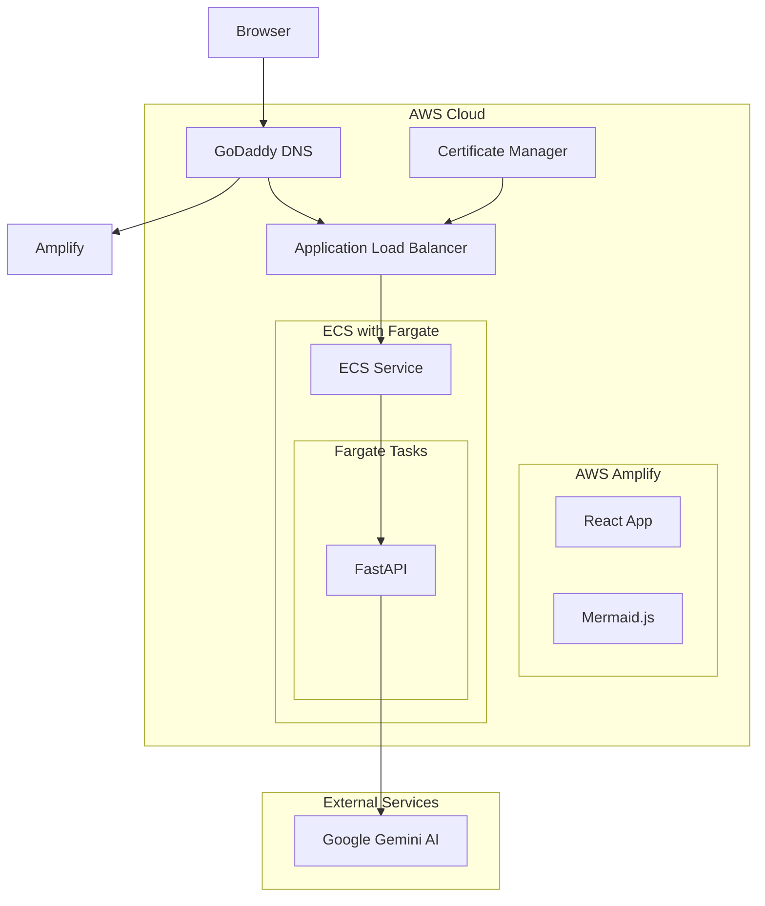

# Text2Diagram

[](https://github.com/anthonyhungnguyen/Text2Diagram/actions/workflows/backend.yml)
[](https://opensource.org/licenses/MIT)

A web application that converts natural language text descriptions into diagrams using AI. Currently supports sequence diagrams, flow charts, and state diagrams using Mermaid.js syntax.

## Features

- Convert natural language descriptions into diagram code
- Supports multiple diagram types:
  - Sequence diagrams
  - Flow charts 
  - State diagrams
- Gallery of example diagrams
- Real-time diagram preview
- Clean, responsive UI

## Architecture



## Tech Stack

Frontend:
- React
- TypeScript
- Redux Toolkit
- Tailwind CSS
- shadcn/ui
- Mermaid.js
- Vite

Backend:
- FastAPI
- Google's Generative AI
- Python 3.10+

Deployment:
- AWS Amplify for frontend hosting
- AWS ECS with Fargate for serverless container orchestration
- AWS Application Load Balancer
- GoDaddy for domain management
- AWS Certificate Manager for SSL

## Getting Started

### Prerequisites

- Node.js 18+
- Python 3.10+
- Poetry (Python package manager)
- Google Cloud API key with Gemini API access

### Installation

1. Clone the repository:
```bash
git clone https://github.com/anthonyhungnguyen/Text2Diagram
cd Text2Diagram
```

2. Install frontend dependencies:
```bash
cd frontend
npm install
npm install @reduxjs/toolkit react-redux @shadcn/ui
```

3. Install backend dependencies:
```bash
cd backend
poetry install
```

### Running Locally

1. Start the backend server:
```bash
cd backend
poetry run gunicorn app.main:app --workers 4 --worker-class uvicorn.workers.UvicornWorker --bind 0.0.0.0:8000
```

2. Start the frontend development server:
```bash
cd frontend
npm run dev
```

3. Open http://localhost:5173 in your browser

### Production Deployment

1. The application is deployed using AWS services with GoDaddy domain management:
```bash
# Frontend: AWS Amplify deployment
# Backend API: ECS Fargate with ALB
# Domain Management: GoDaddy DNS settings
```

2. Infrastructure is managed through:
- AWS Amplify for automated frontend deployment
- ECS Fargate for serverless container orchestration
- Application Load Balancer for API traffic
- GoDaddy for domain management and DNS configuration
- Certificate Manager for SSL/TLS certificates

## License

This project is licensed under the MIT License - see the [LICENSE](LICENSE) file for details.
